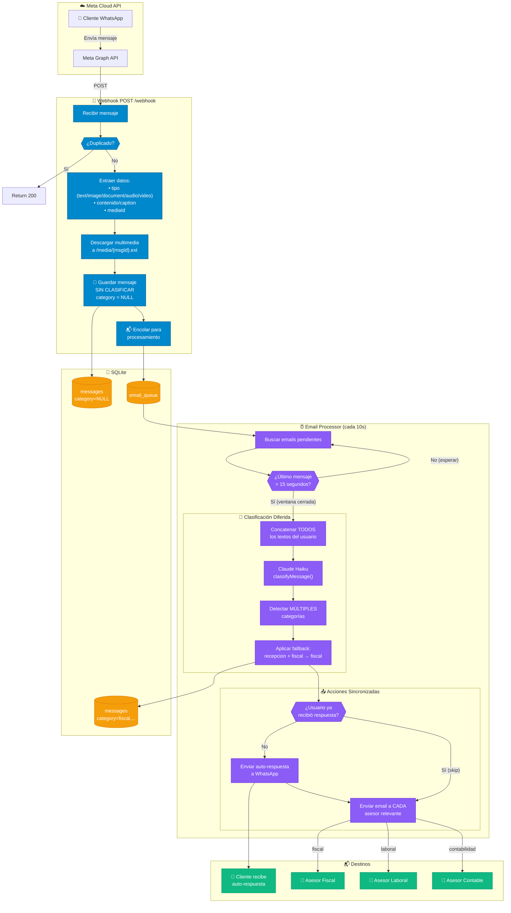
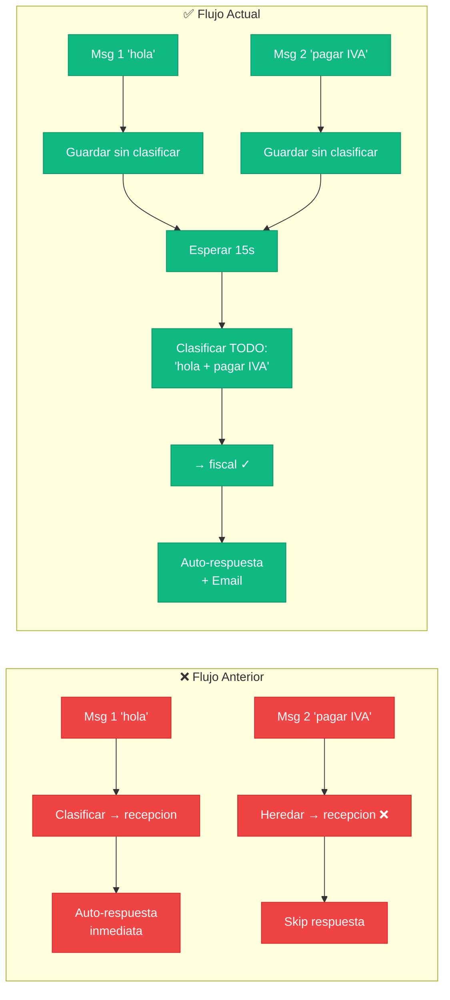
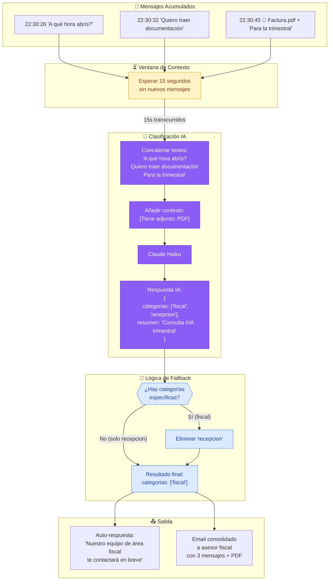
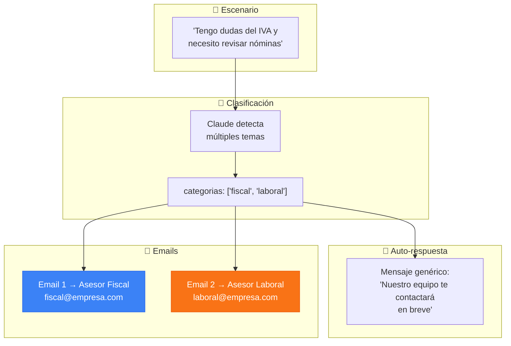
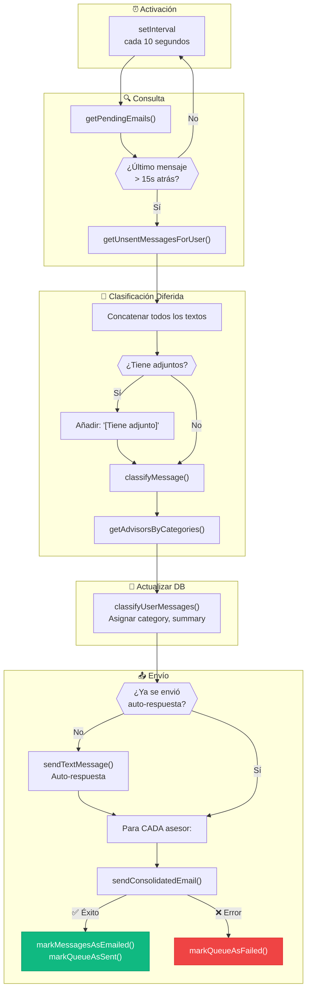
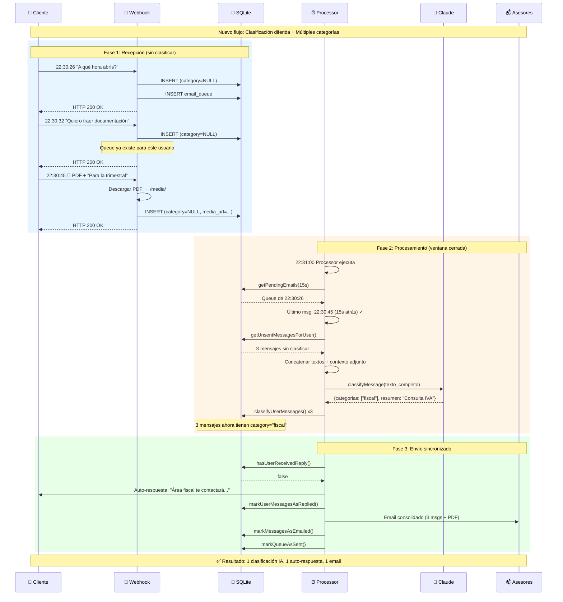
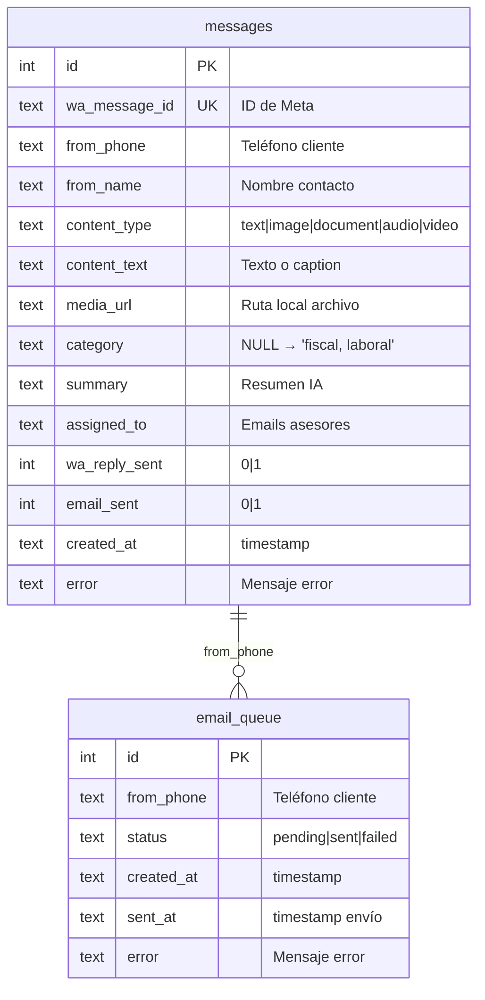
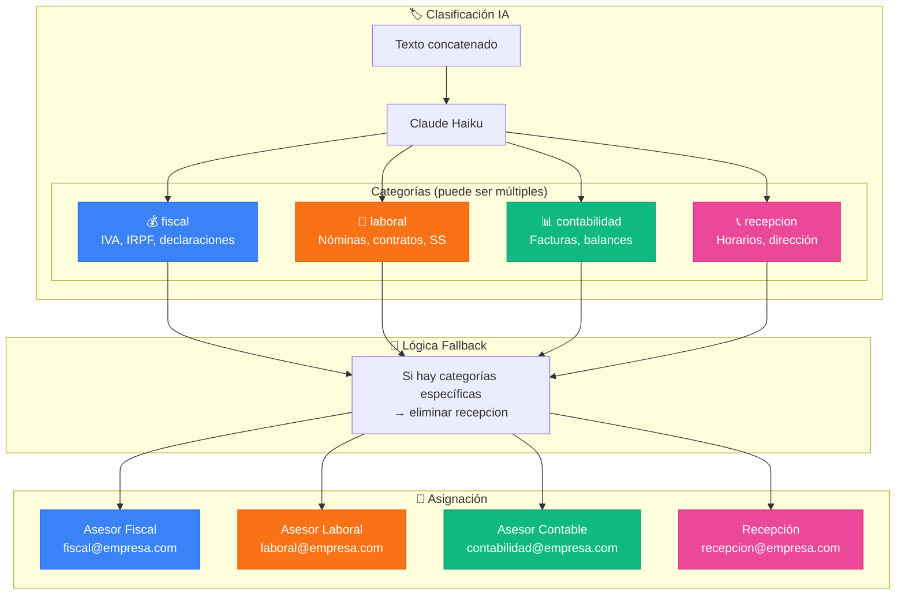
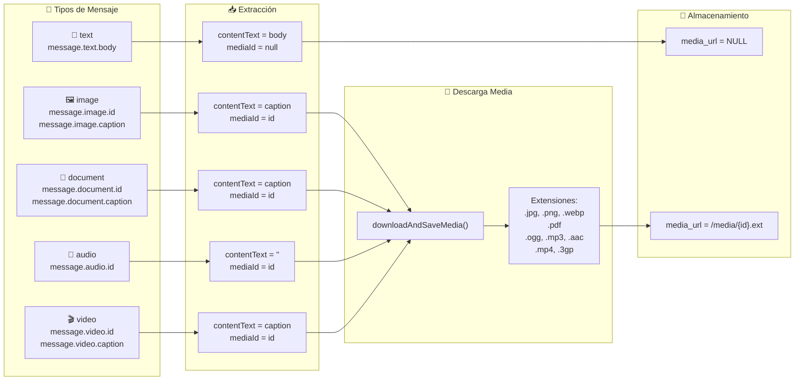

# Diagrama de Flujo - WhatsApp Manager

> **Última actualización:** Soporte audio/video + validación Zod

## Flujo Principal del Sistema



## Comparación: Antes vs Después del Refactor



## Detalle del Flujo de Clasificación



## Manejo de Múltiples Categorías



## Flujo del Email Processor



## Diagrama de Secuencia: Conversación Completa



## Estructura de Datos



## Categorías y Asesores



## Manejo de Tipos de Mensaje



## Resumen de Características

| Característica | Descripción |
|----------------|-------------|
| 🔁 **Deduplicación** | UNIQUE en wa_message_id previene duplicados |
| ⏱️ **Ventana de contexto** | 15 segundos para agrupar mensajes |
| 🤖 **Clasificación diferida** | Se clasifica TODO junto al cerrar ventana |
| 📊 **Múltiples categorías** | La IA puede detectar fiscal + laboral |
| 🔄 **Fallback recepcion** | Si hay categorías específicas, eliminar recepcion |
| 📱 **Auto-respuesta sincronizada** | Se envía al cerrar ventana, no inmediatamente |
| 📧 **Emails múltiples** | Un email a cada asesor relevante |
| 📦 **Consolidación** | Todos los mensajes del usuario en un email |

## Ejemplo Timeline

```
22:30:26  Msg 1 "A qué hora abrís?"          → DB (category=NULL)
22:30:32  Msg 2 "Quiero traer documentación" → DB (category=NULL)
22:30:45  Msg 3 📄 "Para la trimestral IVA"  → DB (category=NULL)

22:31:00  Processor ejecuta
          → Último mensaje hace 15s → PROCESAR
          → Concatenar: "A qué hora abrís?\nQuiero traer...\nPara la trimestral"
          → Claude: {categorias: ["fiscal", "recepcion"], resumen: "..."}
          → Fallback: fiscal + recepcion → solo ["fiscal"]
          → Auto-respuesta: "Nuestro equipo de área fiscal..."
          → Email a asesor fiscal con 3 mensajes + PDF

RESULTADO: 1 clasificación IA, 1 auto-respuesta, 1 email
```
