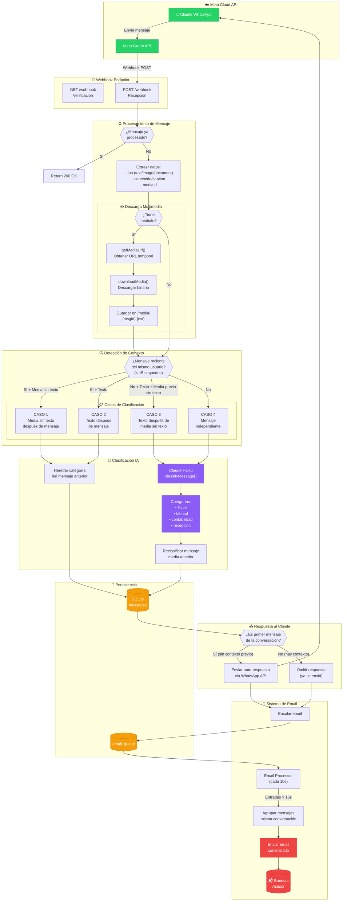
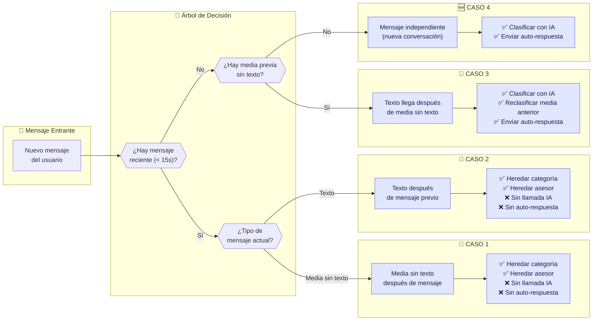
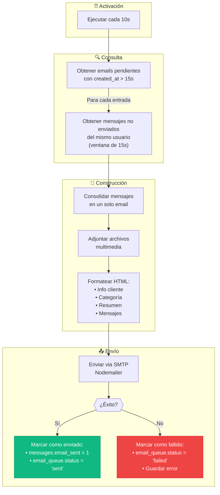
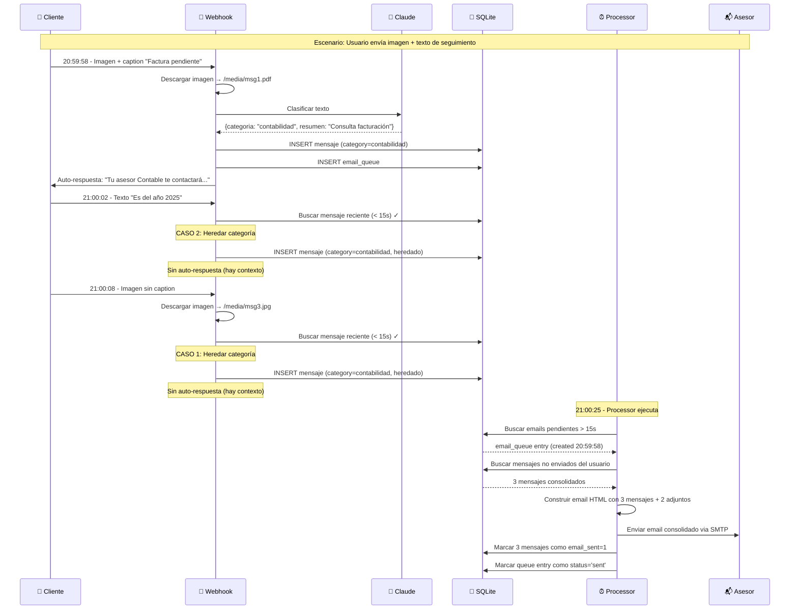
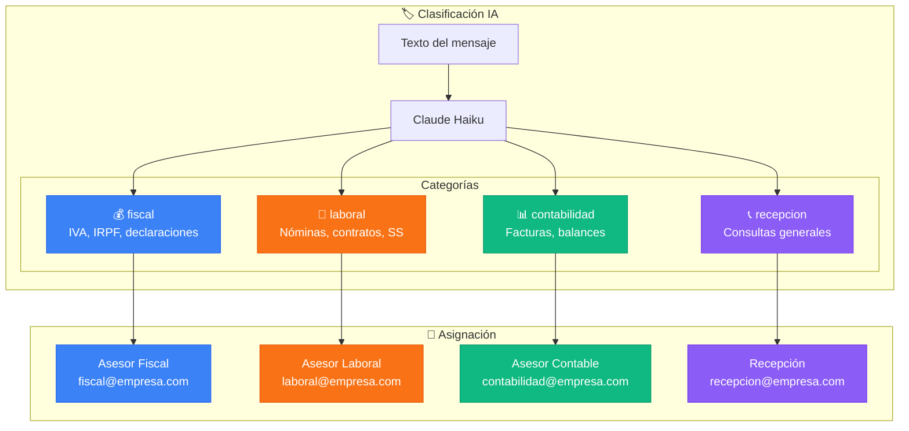
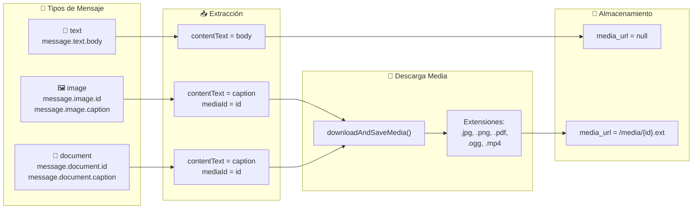

# Diagrama de Flujo - WhatsApp Manager

## Flujo Principal del Sistema

## Detalle de los 4 Casos de Clasificación

## Flujo del Procesador de Email

## Ejemplo Timeline: Conversación Multi-mensaje

## Estructura de Categorías y Asesores

## Manejo de Tipos de Mensaje

## Resumen de Optimizaciones

| Patrón | Descripción | Beneficio |
|--------|-------------|-----------|
| 🔁 Deduplicación | UNIQUE en wa_message_id | Evita procesar duplicados |
| ⏱️ Ventana de contexto | 15 segundos | Agrupa conversaciones |
| 🤖 Herencia de clasificación | Casos 1 y 2 | Reduce llamadas a IA |
| 📧 Email consolidado | Batch de mensajes | Un email por conversación |
| 💬 Auto-respuesta única | Solo primer mensaje | No spam al cliente |
| 🔄 Reclasificación | Caso 3 | Media sin texto clasificada correctamente |
